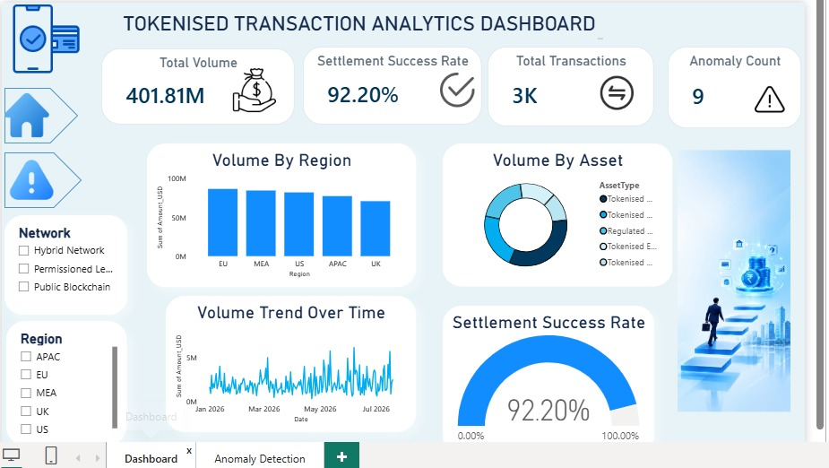
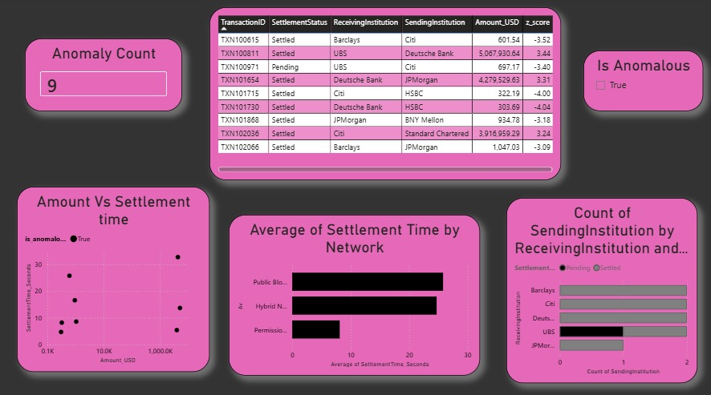

# Tokenised Transaction Analytics

A two-stage analytics project on synthetic tokenised money settlement data, inspired by
Barclays' industry piece on tokenisation as "the next chapter in money's evolution."

**Stack:** Python (Pandas, NumPy, Matplotlib, Seaborn) → Power BI

## Project Overview

This project analyzes 3,000 synthetic tokenised transactions across major financial
institutions (Barclays, JPMorgan, HSBC, UBS, BNY Mellon, Citi, Standard Chartered,
Deutsche Bank), exploring themes raised in the tokenisation debate: settlement speed,
network interoperability, and transaction risk.

The pipeline has two stages:
1. **Python** — cleans the raw data, profiles it, and flags anomalous transactions using
   a documented statistical method (z-score on log-transformed amount)
2. **Power BI** — takes the cleaned + flagged data and builds an interactive dashboard

## Files in this repo

| File | Description |
|---|---|
| `tokenised_transactions.csv` | Raw synthetic dataset (3,000 transactions) |
| `eda_and_anomaly_detection.py` | Python script: cleaning, EDA, anomaly detection, chart generation |
| `tokenised_transactions_cleaned_flagged.csv` | Output of the Python script — feeds Power BI |
| `chart_amount_distribution.png` | Transaction amount distribution with anomaly threshold |
| `chart_volume_by_assettype.png` | Volume breakdown by asset type |
| `chart_settlement_time_by_network.png` | Settlement time by network type (boxplot) |
| `chart_anomaly_scatter.png` | Amount vs. settlement time, anomalies highlighted |
| `Dashboard_Build_Guide.md` | Full Power BI build spec (measures, charts, layout) |

## Python Analysis

The script (`eda_and_anomaly_detection.py`) performs:
- **Cleaning**: duplicate detection, missing value audit (with reasoning — settlement
  time is structurally null for Pending/Failed transactions, not bad data), invalid
  amount filtering
- **EDA**: summary statistics, group-by breakdowns by asset type and network
- **Anomaly detection**: z-score on the log-transformed transaction amount, flagged at
  |z| > 3.0 — found **9 anomalous transactions out of 3,000 (0.30%)**
- **Visualization**: 4 charts covering distribution, category breakdown, network
  comparison, and anomaly highlighting

## Dashboard Screenshots

### Page 1 — Executive Overview

### Page 2 — Anomaly Detection

## Dashboard Demo Video
[Watch Dashboard Demo](VID-20260723-WA0003.mp4)

## Power BI Dashboard

**Page 1 — Executive Overview**
KPI cards (Total Volume, Total Transactions, Settlement Success Rate, Anomaly Count),
volume trend over time, volume by asset type, volume by region, with Region/Network
slicers.

**Page 2 — Anomaly Detection**
Anomaly Count card, average settlement time by network (shows Permissioned Ledger
settling fastest vs. Public Blockchain slowest — the interoperability tradeoff),
interactive scatter chart colour-coded by anomaly flag, and a table of the 9 flagged
transactions.

## Key Finding

Network type has a major effect on settlement speed: Permissioned Ledger transactions
settle in ~8 seconds on average, versus ~60 seconds on Public Blockchain — a concrete
illustration of the interoperability tradeoff discussed in industry commentary on
tokenised money.

## Note on data

All transaction data in this project is synthetic and randomly generated for portfolio
purposes. It does not represent real institutional data.
